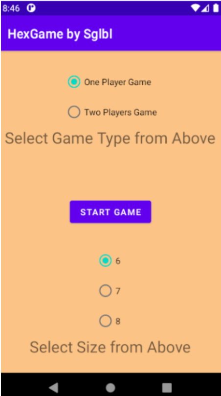
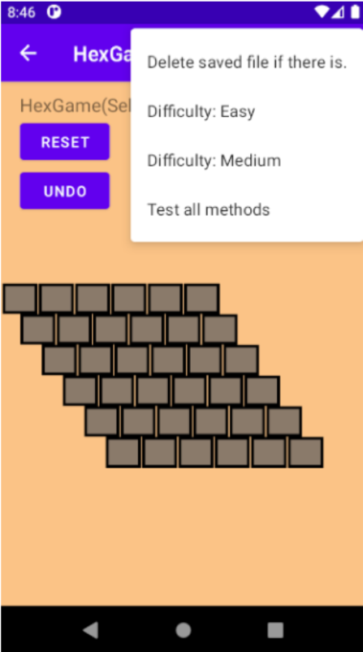

# Hex-Game-for-Android

A game HexGame Interface that defines all methods
Undo feature for a single step

## Example Images from game

## How to Run
The repository consists a .exe file. You can execute the .exe file to run the game.